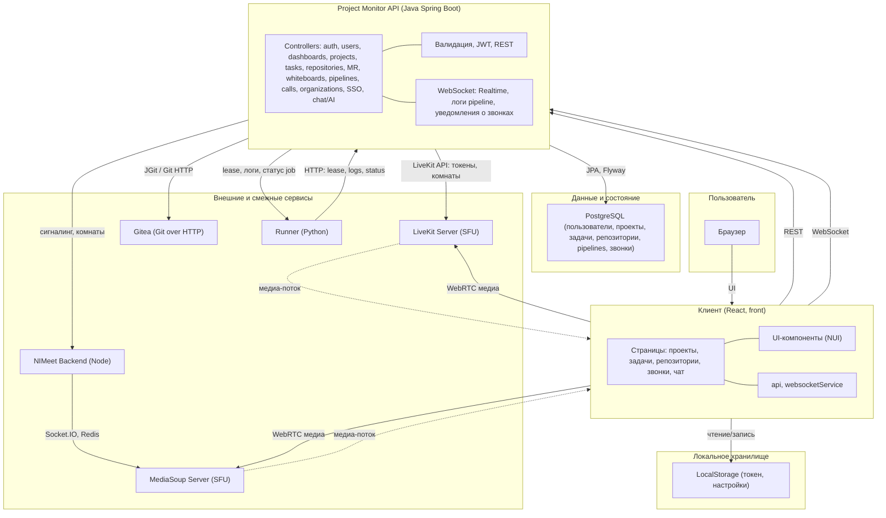

# Архитектура программного продукта Project Monitor

1. Пользователь работает с веб-клиентом React.
2. Клиент обращается к API по REST и по WebSocket (realtime, логи pipeline, уведомления о звонках).
3. API управляет проектами, задачами, pipelines; данные в PostgreSQL, CI/CD — через Runner по HTTP.
4. Видеосвязь — внешние SFU (LiveKit, MediaSoup): API выдаёт токены/комнаты через LiveKit API, сигналинг — NIMeet при необходимости.
5. API (Calls) взаимодействует с LiveKit; медиапоток WebRTC — напрямую клиент ↔ LiveKit/MediaSoup.

---

## Пояснение взаимодействия элементов

**Пользователь** работает в браузере с **клиентским приложением (React, front)**: интерфейс проектов, задач, репозиториев, звонков, чата и AI. Клиент обращается по **REST** к **основному API (Java Spring Boot)** за данными и операциями (проекты, задачи, дашборды, организации, комментарии, pipelines и т.д.), по **WebSocket** получает события в реальном времени (изменения проектов/задач, логи pipeline, уведомления о звонках). Для **видеозвонков** клиент по **WebRTC** подключается к **LiveKit Server (SFU)** или к **MediaSoup Server**; токены и комнаты выдаёт основной API (через LiveKit API) или сервис видеосвязи. **Локальные настройки и сессия** хранятся в **LocalStorage** браузера.

**Основной API** содержит контроллеры (REST и WebSocket), валидацию, бизнес-логику; сохраняет данные в **PostgreSQL** через JPA и ведёт миграции через Flyway. Для **Git** он использует **JGit** (локальные репозитории в файловой системе) или проксирование к **Gitea** (Git over HTTP). Для **CI/CD** API выдаёт задания **Runner (Python)** по HTTP; раннер выполняет job в Docker и отправляет логи/статус обратно в API. **Чат и AI** обрабатываются в API с вызовом внешнего LLM (например, через GPTunnel).

**Внешние и смежные сервисы** (не входят в ядро одного приложения): **LiveKit Server** и **MediaSoup Server** — маршрутизация медиа (SFU); **Gitea** — опциональный хостинг Git-репозиториев; **Runner** — служба выполнения pipeline job; **NIMeet backend** (при использовании) — сигналинг и комнаты для части видеозвонков, с **MongoDB** и **Redis**. Все компоненты могут разворачиваться в одной среде через **Docker Compose**.

---

## Схема архитектуры

---

## Условные обозначения

- **Сплошные стрелки** — запросы/управление (REST, WebSocket, HTTP, API).
- **Пунктир** — медиа-канал (WebRTC между клиентом и SFU).
- **Клиент** — SPA на React (Vite), собирается в статику, раздаётся через Nginx.
- **Project Monitor API** — единый серверный компонент (REST + WebSocket); взаимодействует с БД, Git, LiveKit, Runner, NIMeet.
- **Внешние сервисы** — могут разворачиваться отдельно (LiveKit, MediaSoup, Gitea, Runner, NIMeet); архитектурно не входят в «ядро» одного приложения.

Схему можно отобразить в предпросмотре Markdown (VS Code, GitHub) или на [mermaid.live](https://mermaid.live) и экспортировать в PNG/SVG для слайда.
