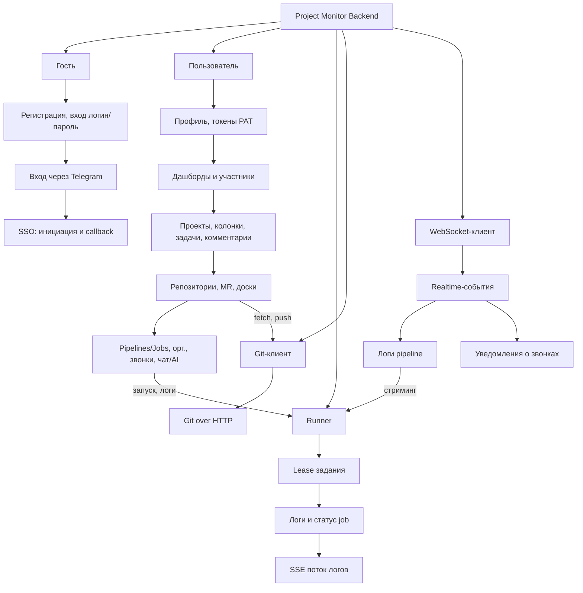
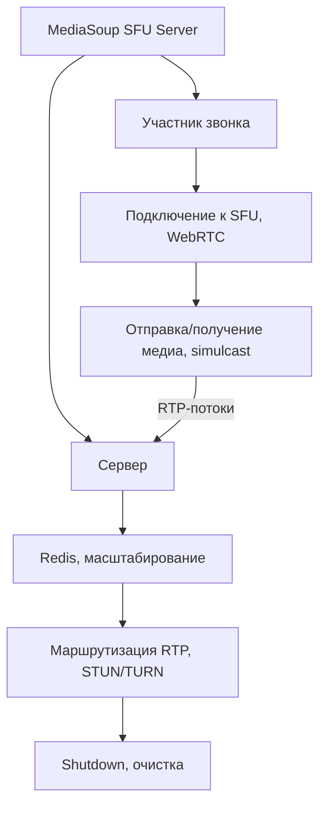

# Функциональная схема серверных приложений

Ниже представлены функциональные схемы в виде иерархии: **приложение → блоки ролей → зависимые функции**. Схемы нарисованы кодом (Mermaid) и могут быть отображены в любом редакторе с поддержкой Mermaid (GitHub, GitLab, VS Code с расширением и т.д.).

---

## 1. Project Monitor Backend (основное серверное приложение)

Компактная схема: приложение → роли → функции; стрелками показаны иерархия и связи между ролями (например, запуск pipeline и просмотр логов связаны с Runner).

---

## 2. MediaSoup SFU Server (сервис видеозвонков)

Компактная схема с вертикальными цепочками функций и связью участника с сервером (медиа идёт через SFU).

---

## Текстовая иерархия (для вставки в документ/слайд)

### Project Monitor Backend

| Уровень | Элемент |
|--------|--------|
| **Приложение** | Project Monitor Backend |
| **Роль** | Гость / Неаутентифицированный |
| ↳ Функции | Регистрация; Вход (логин/пароль); Вход через Telegram; SSO |
| **Роль** | Пользователь |
| ↳ Функции | Профиль; Токены; Дашборды и участники; Проекты; Колонки и задачи; Комментарии; Привязка веток; Репозитории и участники; MR и обсуждения; Whiteboards; Pipelines и Jobs; Организации, участники и роли; Звонки; Чат и AI |
| **Роль** | Runner |
| ↳ Функции | Lease; Отправка логов/статуса job; SSE поток логов |
| **Роль** | Git-клиент |
| ↳ Функции | Git over HTTP |
| **Роль** | Клиент WebSocket |
| ↳ Функции | Realtime; Логи pipeline; Уведомления о звонках |

### MediaSoup SFU Server

| Уровень | Элемент |
|--------|--------|
| **Приложение** | MediaSoup SFU Server |
| **Роль** | Участник звонка |
| ↳ Функции | Подключение к SFU; Отправка/получение медиа; Simulcast; Отключение |
| **Роль** | Сервер (внутренние) |
| ↳ Функции | Redis; Маршрутизация RTP; STUN/TURN; Shutdown |

---

## Как отобразить Mermaid-схемы

- **GitHub / GitLab**: вставьте блок кода с `mermaid` в `.md` файл — диаграмма отрисуется в предпросмотре.
- **VS Code**: установите расширение "Markdown Preview Mermaid Support" и откройте предпросмотр (Ctrl+Shift+V).
- **Онлайн**: скопируйте код в [mermaid.live](https://mermaid.live) и экспортируйте в PNG/SVG для слайда.

При необходимости можно упростить схему (меньше функций в блоках) или разбить «Пользователь» на подроли (Owner, Admin, Member, Guest организации и OWNER, ADMIN, DEVELOPER, VIEWER проекта).
