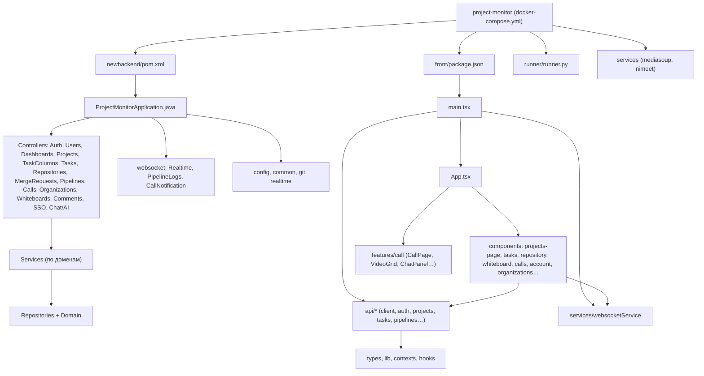

# Структурная схема проекта Project Monitor

Схема отражает структуру основных модулей и зависимостей всего проекта (фронт и бэк). Под схемой — таблица элементов и их описание.

---

## Схема структуры

---

## Описание элементов схемы

| Название | Описание |
|----------|----------|
| docker-compose.yml | Файл решения: frontend, backend, БД, runner, LiveKit, MediaSoup, Gitea. |
| newbackend/pom.xml | Серверный проект API (Maven, Java, Spring Boot). |
| newbackend/.../ProjectMonitorApplication.java | Точка входа backend. |
| newbackend/.../Controllers/* | REST API: auth, users, dashboards, projects, tasks, repos, MR, pipelines, calls, orgs, whiteboards, comments, SSO, chat. |
| newbackend/.../Services/* | Бизнес-логика по доменам, интеграция с БД и внешними сервисами. |
| newbackend/.../websocket/* | WebSocket: realtime, логи pipeline, уведомления о звонках. |
| newbackend/.../domain, repo, dto | Модели, репозитории JPA, DTO. |
| newbackend/.../config, common, git | Конфигурация, обработка ошибок, JGit. |
| front/package.json | Зависимости и сборка frontend (React, Vite). |
| front/src/main.tsx | Точка входа UI. |
| front/src/App.tsx | Корневой компонент, маршрутизация, layout. |
| front/src/components/* | Страницы и UI: проекты, задачи, репо, whiteboard, звонки, аккаунт, орг. |
| front/src/features/call/* | Модуль видеозвонка (CallPage, VideoGrid, ChatPanel). |
| front/src/api/* | REST-клиенты к backend. |
| front/src/services/websocketService.ts | Подключение к WebSocket backend. |
| front/src/types, contexts, hooks | Типы, контексты, хуки. |
| runner/runner.py | CI/CD: задания от API, job в Docker, логи/статус. |
| LiveKit, MediaSoup, NIMeet (внешние) | SFU и сигналинг видеосвязи; медиа — клиент ↔ SFU. |

---

Схему можно отобразить в предпросмотре Markdown или на [mermaid.live](https://mermaid.live) и экспортировать в PNG/SVG для слайда.
