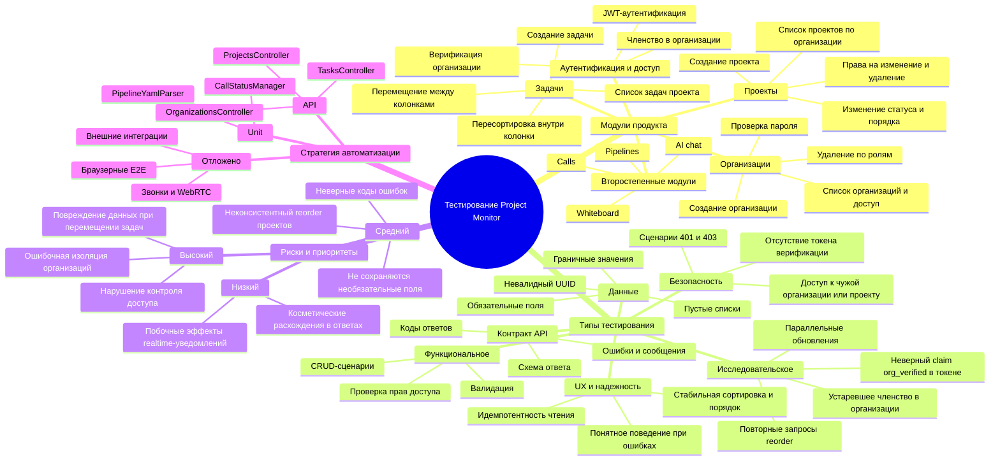

# Интеллект-карта тестирования Project Monitor

## Примечания
- Основной объем для дипломного пакета: организации, проекты, задачи.
- Зоны высокого риска: контроль доступа, изоляция организаций и корректность потока работы с задачами.
- Второстепенные модули включены в карту для демонстрации понимания системы, но не все автоматизированы в первой итерации.
